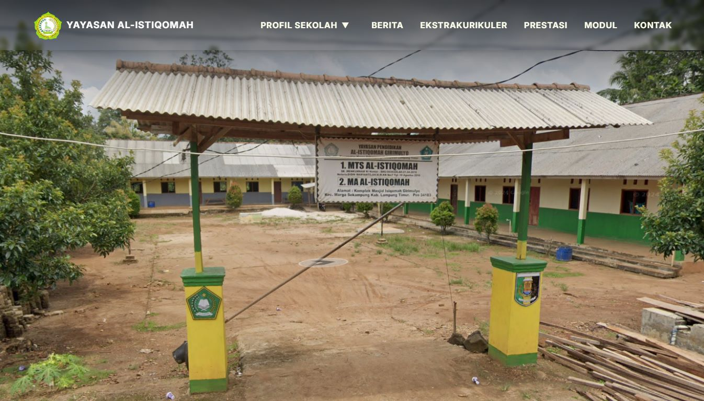

# 🚀 Professional Portfolio Upgrade - Implementation Guide

## Status: ✅ Phase 1 Complete

Saya sudah mengimplementasikan:
1. ✅ Typography improvements (line-height, letter-spacing)
2. ✅ Better button hover effects (shadow + lift)
3. ✅ Card hover animations (smooth + professional)
4. ✅ Service box enhancements (better shadows)
5. ✅ Global smooth transitions
6. ✅ Improved spacing & padding

---

## 📋 Next Steps (Pick 3-5 untuk implementasi)

### EASY (15 menit each)

#### 1️⃣ Add Project Tags/Technologies
**Impact:** High | Difficulty: Easy

File: `index.html` (update project cards)
```html
<div class="project-card">
  
  <div class="project-info">
    <h3>Web Development</h3>
    <div class="project-tags">
      <span class="tag html">HTML</span>
      <span class="tag css">CSS</span>
      <span class="tag js">JavaScript</span>
    </div>
    <p>Membuat Sistem Informasi Website Yayasan MTs / MA Al-Istiqomah</p>
    <a href="https://github.com/edwindarrenhasannudin/al-istiqomah" target="_blank">
      <i class="fa-solid fa-up-right-from-square"></i>
    </a>
  </div>
</div>
```

File: `styles/portfolio.css` (add styling)
```css
.project-tags {
  display: flex;
  gap: 8px;
  margin: 10px 0;
  flex-wrap: wrap;
  justify-content: center;
}

.tag {
  display: inline-block;
  padding: 4px 12px;
  background: rgba(0, 171, 240, 0.1);
  color: var(--main-color);
  border-radius: 20px;
  font-size: 0.8em;
  font-weight: 600;
}

.tag:hover {
  background: rgba(0, 171, 240, 0.2);
}
```

---

#### 2️⃣ Optimize Images
**Impact:** High | Difficulty: Easy

1. Go to: https://tinypng.com
2. Upload all images di `assets/`
3. Download compressed versions
4. Replace original files

Target sizes:
- Profile image: < 100KB
- Project thumbnails: < 80KB
- Certificate images: < 150KB

---

#### 3️⃣ Improve Meta Tags (SEO)
**Impact:** Medium | Difficulty: Easy

File: `index.html` (update head section)
```html
<head>
    <meta charset="UTF-8">
    <meta http-equiv="X-UA-Compatible" content="IE=edge">
    <meta name="viewport" content="width=device-width, initial-scale=1.0">
    
    <!-- Better Description -->
    <meta name="description" content="Edwin Darren H - Full-Stack Developer & UI/UX Designer. Showcasing 15+ web development and design projects. Informatics Engineering student at Institut Teknologi Sumatera.">
    
    <!-- Keywords -->
    <meta name="keywords" content="Edwin Darren, Web Developer, UI/UX Designer, Web Design, JavaScript, React, Informatika, ITERA, Portfolio">
    
    <!-- Open Graph (Social Share) -->
    <meta property="og:title" content="Edwin Darren H - Portfolio">
    <meta property="og:description" content="Full-Stack Developer & UI/UX Designer with 15+ Projects">
    <meta property="og:image" content="https://yoursite.com/assets/Profil%20Edwin.jpg">
    <meta property="og:type" content="website">
    
    <!-- Twitter Card -->
    <meta name="twitter:card" content="summary_large_image">
    <meta name="twitter:title" content="Edwin Darren H - Portfolio">
    <meta name="twitter:description" content="Check out my web development & design projects">
    <meta name="twitter:image" content="https://yoursite.com/assets/Profil%20Edwin.jpg">
    
    <title>Edwin Darren H - Portfolio | Developer & Designer</title>
    ...
</head>
```

---

#### 4️⃣ Add Skill Bars to About Section
**Impact:** Medium | Difficulty: Easy

File: `index.html` (update about section)
```html
<section class="about" id="about">
    <div class="about-container">
        <h2 class="section-title">About Me</h2>
        <div class="about-content">
            <div class="about-img">
                
            </div>
            <div class="about-text">
                <p>Saya adalah seorang mahasiswa Teknik Informatika yang tertarik dalam pengembangan perangkat lunak, pengembangan web, dan desain ui / ux. Saya bersemangat untuk terus belajar teknologi baru dan memecahkan masalah kompleks melalui solusi teknologi inovatif.</p>
                
                <!-- Add Skills -->
                <div class="skills-list">
                    <h3>Technical Skills</h3>
                    <div class="skill-item">
                        <div class="skill-header">
                            <span>Frontend Development</span>
                            <span>85%</span>
                        </div>
                        <div class="skill-bar">
                            <div class="skill-progress" style="width: 85%;"></div>
                        </div>
                    </div>
                    <div class="skill-item">
                        <div class="skill-header">
                            <span>UI/UX Design</span>
                            <span>80%</span>
                        </div>
                        <div class="skill-bar">
                            <div class="skill-progress" style="width: 80%;"></div>
                        </div>
                    </div>
                    <div class="skill-item">
                        <div class="skill-header">
                            <span>Backend Development</span>
                            <span>75%</span>
                        </div>
                        <div class="skill-bar">
                            <div class="skill-progress" style="width: 75%;"></div>
                        </div>
                    </div>
                </div>
                
                <p>Selain itu, saya aktif terlibat dalam organisasi kampus untuk meningkatkan kemampuan kepemimpinan dan komunikasi saya.</p>
            </div>
        </div>
    </div>
</section>
```

File: `styles/about.css` (add styling)
```css
.skills-list {
  margin: 2rem 0;
  text-align: left;
}

.skills-list h3 {
  margin-bottom: 1.5rem;
  color: var(--main-color);
  font-size: 1.2em;
}

.skill-item {
  margin-bottom: 1.5rem;
}

.skill-header {
  display: flex;
  justify-content: space-between;
  margin-bottom: 0.5rem;
  font-size: 0.95em;
}

.skill-bar {
  height: 8px;
  background: rgba(0, 171, 240, 0.1);
  border-radius: 4px;
  overflow: hidden;
}

.skill-progress {
  height: 100%;
  background: linear-gradient(90deg, var(--main-color), var(--main-color) 70%, rgba(0, 171, 240, 0.5));
  border-radius: 4px;
  transition: width 1.5s ease-in-out;
}
```

---

### MEDIUM (30 menit each)

#### 5️⃣ Add Hero Stats
**Impact:** Medium | Difficulty: Medium

File: `index.html` (update home section)
```html
<section class="home" id="home">
    <div class="home-content">
        <h1>Hi, I'm Edwin Darren H</h1>
        <h3>Informatics Engineering Student</h3>
        
        <!-- Add Hero Stats -->
        <div class="hero-stats">
            <div class="stat">
                <h4>15+</h4>
                <p>Projects</p>
            </div>
            <div class="stat">
                <h4>6</h4>
                <p>Semesters</p>
            </div>
            <div class="stat">
                <h4>3</h4>
                <p>Skills</p>
            </div>
        </div>
        
        <p>Saya berkuliah di <u>Institut Teknologi Sumatera</u>...</p>
        ...
    </div>
    ...
</section>
```

File: `styles/home.css` (add styling)
```css
.hero-stats {
  display: flex;
  gap: 3rem;
  margin: 2rem 0;
  justify-content: flex-start;
  flex-wrap: wrap;
}

.stat {
  position: relative;
}

.stat h4 {
  font-size: 2.5em;
  color: var(--main-color);
  margin: 0;
  line-height: 1;
}

.stat p {
  font-size: 0.95em;
  color: var(--snd-text-color);
  margin: 0.5rem 0 0 0;
}

@media (max-width: 768px) {
  .hero-stats {
    gap: 2rem;
  }
  
  .stat h4 {
    font-size: 2em;
  }
}
```

---

#### 6️⃣ Deploy to Netlify (Free)
**Impact:** Very High | Difficulty: Medium

1. Go to: https://netlify.com
2. Click "Drop files to deploy"
3. Drag & drop your `Portfolio` folder
4. Get instant live URL
5. (Optional) Add custom domain

Or use GitHub:
1. Create GitHub repo: `portfolio`
2. Push your code
3. Go to Settings → Pages
4. Enable GitHub Pages
5. Live at: `https://yourusername.github.io/portfolio`

---

### ADVANCED (1+ hour)

#### 7️⃣ Add Contact Form Validation
**Impact:** High | Difficulty: Advanced

File: `js/contact-form.js` (create new file)
```javascript
const ContactForm = (() => {
  const form = document.querySelector('form[action*="formsubmit"]');
  
  const init = () => {
    if (!form) return;
    form.addEventListener('submit', handleSubmit);
  };
  
  const handleSubmit = (e) => {
    const name = form.querySelector('input[name="name"]');
    const email = form.querySelector('input[name="email"]');
    const message = form.querySelector('textarea[name="message"]');
    
    // Validation
    if (!name.value.trim()) {
      e.preventDefault();
      alert('Please enter your name');
      return false;
    }
    
    if (!isValidEmail(email.value)) {
      e.preventDefault();
      alert('Please enter a valid email');
      return false;
    }
    
    if (message.value.length < 10) {
      e.preventDefault();
      alert('Message must be at least 10 characters');
      return false;
    }
    
    // Show success message
    alert('Thank you! I will get back to you soon.');
  };
  
  const isValidEmail = (email) => {
    return /^[^\s@]+@[^\s@]+\.[^\s@]+$/.test(email);
  };
  
  return { init };
})();
```

File: `index.html` (add script)
```html
<script src="js/contact-form.js"></script>
```

File: `main.js` (initialize)
```javascript
if (typeof ContactForm !== 'undefined') {
  ContactForm.init();
}
```

---

#### 8️⃣ Add Dark/Light Mode Toggle (Better)
**Impact:** Medium | Difficulty: Advanced

File: `styles/variables.css` (add dark mode class)
```css
.dark-theme {
  --bg-color: #081b29;
  --snd-bf-color: #0b2b3a;
  --text-color: #ededed;
}

.light-theme {
  --bg-color: #f5f5f5;
  --snd-bf-color: #efefef;
  --text-color: #222222;
  --main-color: #0084bb; /* Darker for light bg */
}
```

File: `js/theme-toggle.js` (enhance existing)
```javascript
const ThemeToggle = (() => {
  const htmlElement = document.documentElement;
  const themeKey = 'portfolio-theme';
  
  const init = () => {
    // Load saved theme
    const savedTheme = localStorage.getItem(themeKey) || 'dark-theme';
    setTheme(savedTheme);
    
    // Listen to icon click
    const icon = document.querySelector('#icon');
    if (icon) {
      icon.addEventListener('click', toggle);
    }
  };
  
  const setTheme = (theme) => {
    htmlElement.classList.remove('dark-theme', 'light-theme');
    htmlElement.classList.add(theme);
    localStorage.setItem(themeKey, theme);
  };
  
  const toggle = () => {
    const currentTheme = htmlElement.classList.contains('dark-theme') ? 'dark-theme' : 'light-theme';
    const newTheme = currentTheme === 'dark-theme' ? 'light-theme' : 'dark-theme';
    setTheme(newTheme);
  };
  
  return { init };
})();
```

---

## 📊 Implementation Timeline

### Week 1 (Priority: High)
- [ ] Day 1-2: Optimize images & add project tags
- [ ] Day 3-4: Improve SEO meta tags
- [ ] Day 5-7: Deploy to Netlify/GitHub Pages

**Time Investment:** ~2-3 hours
**Result Impact:** 🟢 Very High - Portfolio goes live!

### Week 2 (Priority: Medium)
- [ ] Add skill bars to about section
- [ ] Add hero stats
- [ ] Improve project descriptions
- [ ] Add more detailed certificates info

**Time Investment:** ~4-5 hours
**Result Impact:** 🟡 Medium - Better content

### Week 3 (Priority: Low)
- [ ] Add form validation
- [ ] Improve light/dark theme
- [ ] Add analytics (Google Analytics)
- [ ] Performance optimization

**Time Investment:** ~6-8 hours
**Result Impact:** 🟠 Low - Polish & analytics

---

## ✅ Quality Checklist Before Deploy

- [ ] All images optimized (< 100KB each)
- [ ] Links work correctly
- [ ] Mobile responsive (test on phone)
- [ ] Form submissions work
- [ ] No broken images
- [ ] No console errors (F12)
- [ ] Page load time < 3 seconds
- [ ] All text readable
- [ ] Navigation works

---

## 🎯 Deploy Checklist

### Before Going Live

```bash
# 1. Test locally
npm start  # or open index.html

# 2. Clear cache
Ctrl + Shift + Del (or Cmd + Shift + Del on Mac)

# 3. Test in incognito mode
Ctrl + Shift + N (or Cmd + Shift + N on Mac)

# 4. Check on mobile
Open on actual phone or use DevTools mobile view

# 5. Validate HTML
Go to: https://validator.w3.org

# 6. Check performance
Go to: https://pagespeed.web.dev
```

### After Going Live

```bash
# 1. Test live URL
# 2. Share with friends/mentors
# 3. Ask for feedback
# 4. Monitor analytics
# 5. Fix bugs if any
```

---

## 📞 Support Resources

### Tools Used
- **Netlify:** https://netlify.com (free hosting)
- **GitHub Pages:** https://pages.github.com (free hosting)
- **TinyPNG:** https://tinypng.com (image compression)
- **PageSpeed:** https://pagespeed.web.dev (performance)
- **W3C Validator:** https://validator.w3.org (HTML validation)

### Learning Resources
- **CSS Tricks:** https://css-tricks.com
- **Web.dev:** https://web.dev
- **MDN Docs:** https://developer.mozilla.org
- **Figma Tutorials:** https://figma.com/learning

---

## 🚀 Final Tips

1. **Start Small** - Pick 1-2 improvements first
2. **Test Everything** - Always test before deploying
3. **Get Feedback** - Share with friends
4. **Keep Iterating** - Portfolio is never "done"
5. **Have Fun** - Enjoy the process!

---

**Ready to upgrade? Pick one task and start now! 💪**

Rekomendasi urutan:
1. Optimize images (15 min)
2. Add project tags (15 min)
3. Improve SEO (15 min)
4. Deploy (30 min)
= **Total: ~75 minutes** untuk hasil yang signifikan!
